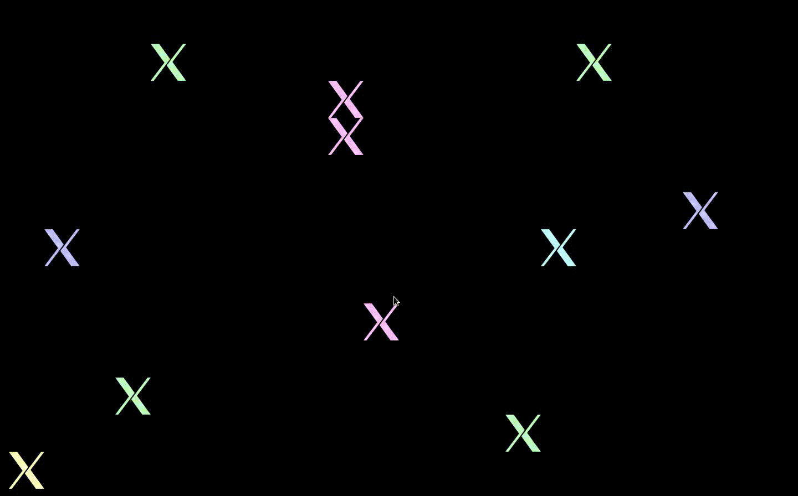
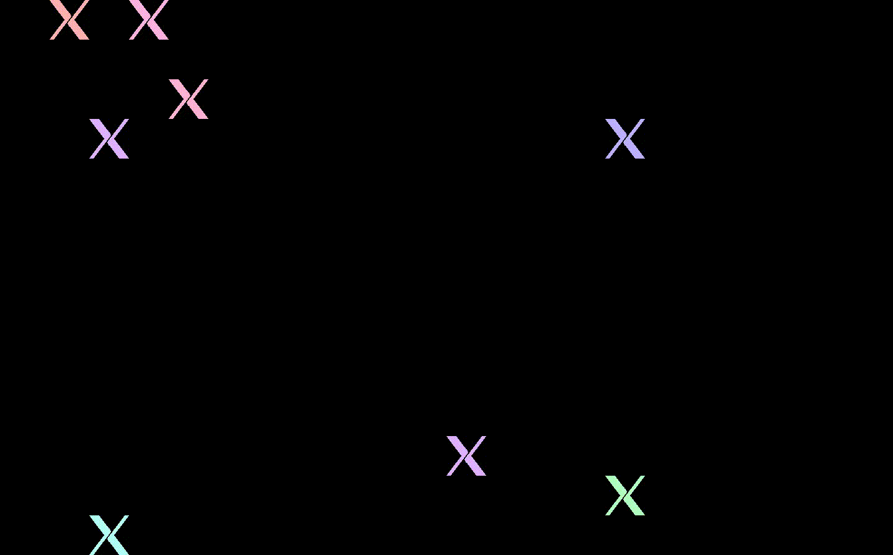

A simulator/clone of a screensaver in <abbr title="Common Desktop Environment">CDE</abbr>, called 'Random bouncing image'. It's a bit of a misnomer since nothing is bouncing, and there's not much randomisation..

This program does try to go fullscreen and will quit when the mouse is moved, but I'm not sure if it can actually be set as a screensaver.

Recording of JRandomBouncingImage:

Recording of original 'Random bouncing image' screensaver:

